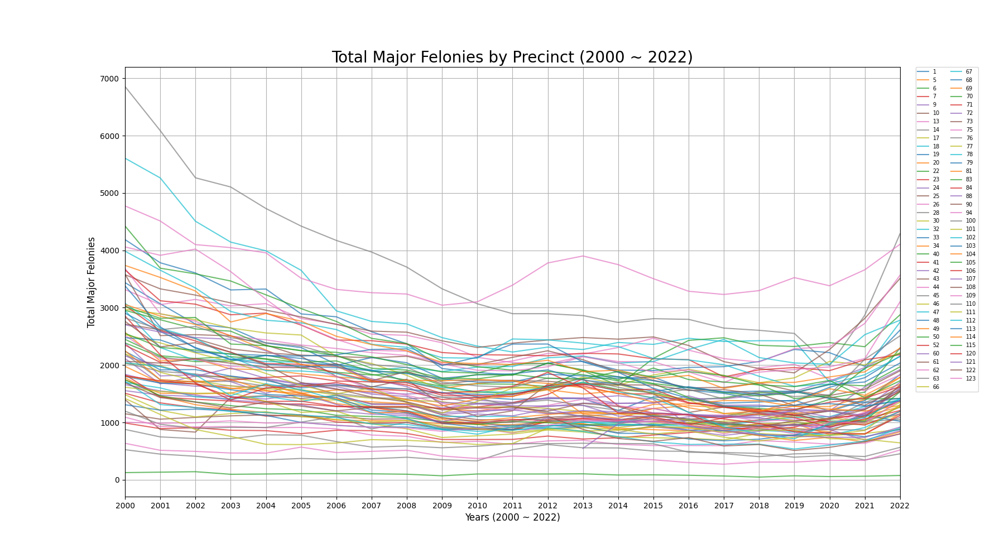
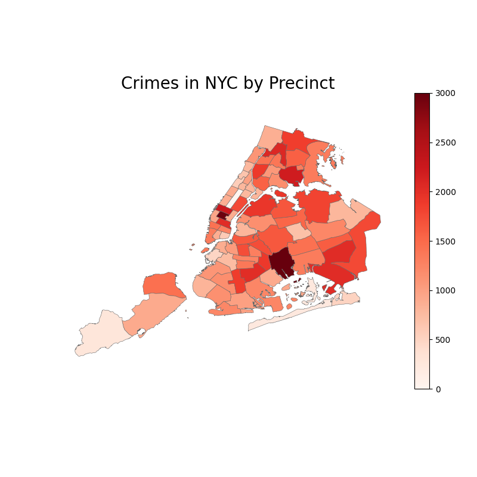
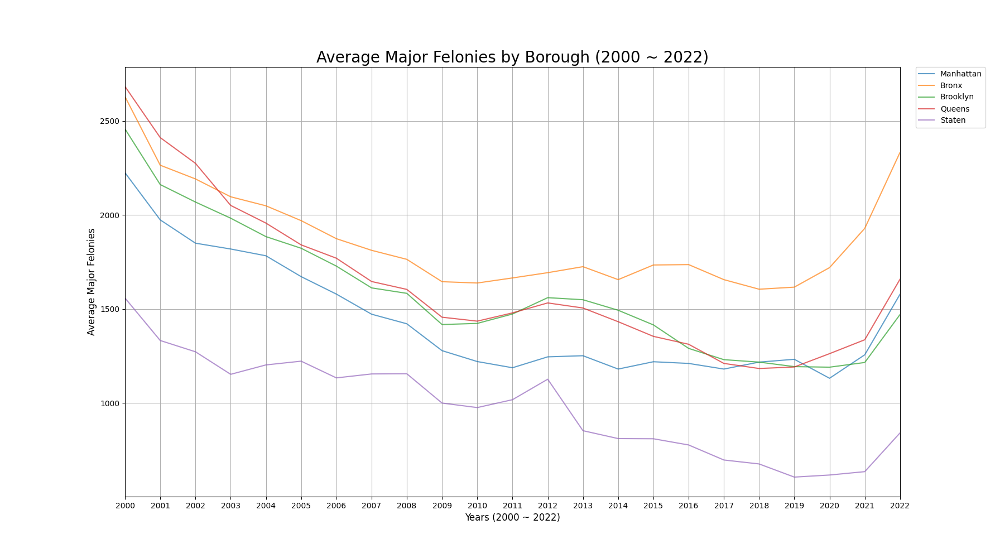
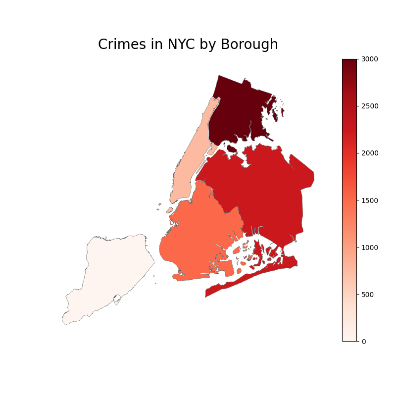
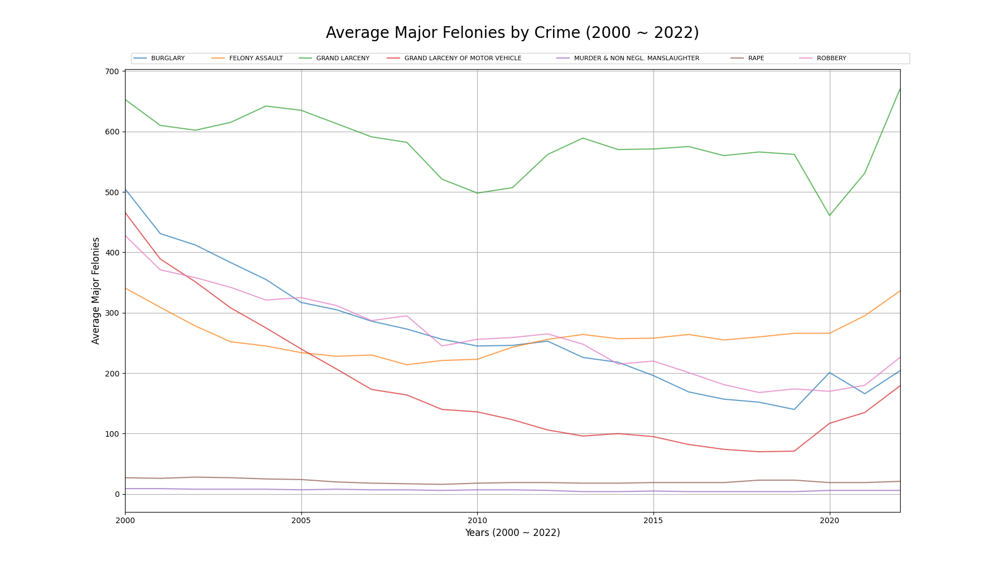

<h1 align="center">
  <br>
  <a href="https://github.com/euisungkang/NYC-Major-Felony-Offenses"></a>
  <br>
  NYC Major Felony Offenses 
  <br>
</h1>

<p align="center">
  <a href="https://www.python.org/">
     
  </a>
  <a href="https://pypi.org/">
    
  </a>
  <a href="https://numpy.org/">
    
  </a><br>
  <a href="https://pypi.org/project/shapely/">
    
  </a>
  <a href="https://matplotlib.org/stable/">
    
  </a>
  <a href="">
    
  </a>
</p>

<p align="center">
  <a href="#usage">Usage</a>
  •
  <a href="#visualizations">Visualizations</a>
  •
  <a href="#data source">Data Source</a>
  •
  <a href="#contributing">Contributing</a>
  •
  <a href="#license">License</a>
</p>

# Overview
This Python program utilizes data from the [NYC Open Data](https://opendata.cityofnewyork.us/) released by the NYPD to create insightful visualizations of major felony offenses in New York City from 2000 to 2022.
# Usage
To run the program and generate the visualizations, follow these steps:

1. **Clone the repository:**
   ```bash
   git clone https://github.com/euisungkang/nyc-major-felonies.git
   ```
2. **Install the required dependencies**
    ```bash
    pip install -r requirements.txt
    ```
3. **Run the main script**
    ```bash
    python main.py
    ```

Make sure you have Python installed on your machine, and consider using a virtual environment to manage dependencies. Adjust the commands based on your project structure and requirements.

# Visualizations

### Total Major Felonies by Precinct
<figure>
  
  <figcaption>Line plot showcasing the trend of total number of major felonies in each precinct from 2000 ~ 2022</figcaption>
</figure>

#### Heatmap by Precinct
<figure>

  <figcaption>Heatmap visualizations offering an at-a-glance view of major felonies distribution across precincts</figcaption>
</figure>

### Average Major Felonies by Borough
<figure>
  
  <figcaption>Line plot showcasing the trend of average number of major felonies in each borough from 2000 ~ 2022</figcaption>
</figure>

#### Heatmap by Borough
<figure>
  
  <figcaption>Heatmap visualizations offering an at-a-glance view of major felonies distribution across boroughs</figcaption>
</figure>

### Average Major Felonies by Crime
<figure>
  
  <figcaption>Line plot showcasing the trend of average number of crimes by each felony type from 2000 ~ 2022</figcaption>
</figure>

# Data Source
The data is sourced from the [NYC Open Data](https://opendata.cityofnewyork.us/), and released by the [NYPD](https://www.nyc.gov/site/nypd/stats/crime-statistics/historical.page). The dataset spans from the year 2000 to 2022, providing a comprehensive view of major felony offenses in New York City.

# Contributing
If you'd like to contribute to this project, please check out our [contribution guidelines](CONTRIBUTING.md).

# License

Artwork created by [Midjourney AI](https://www.midjourney.com/explore).

Released under the [MIT](LICENSE) license.
