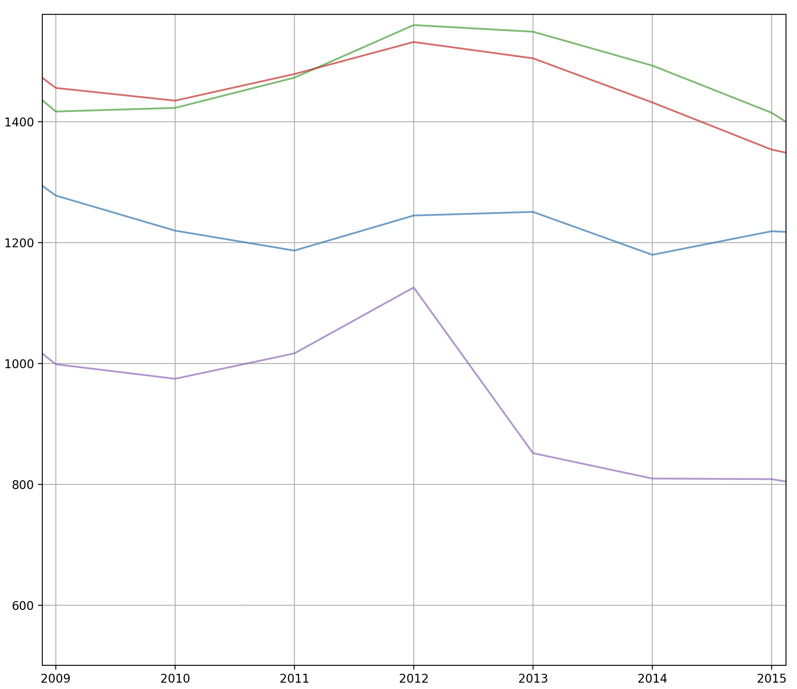
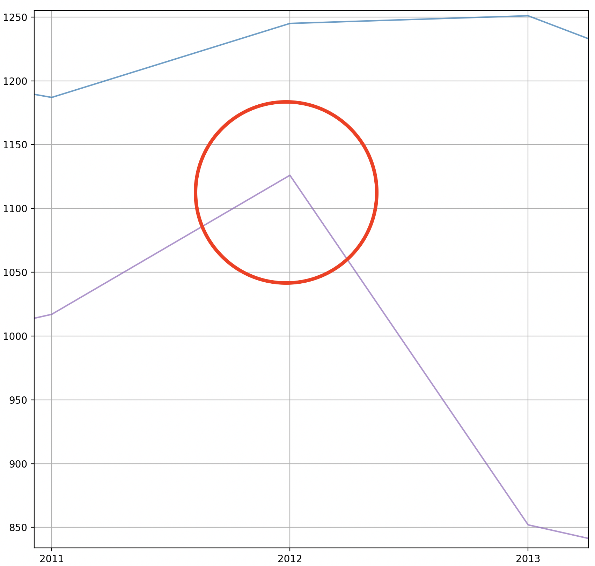
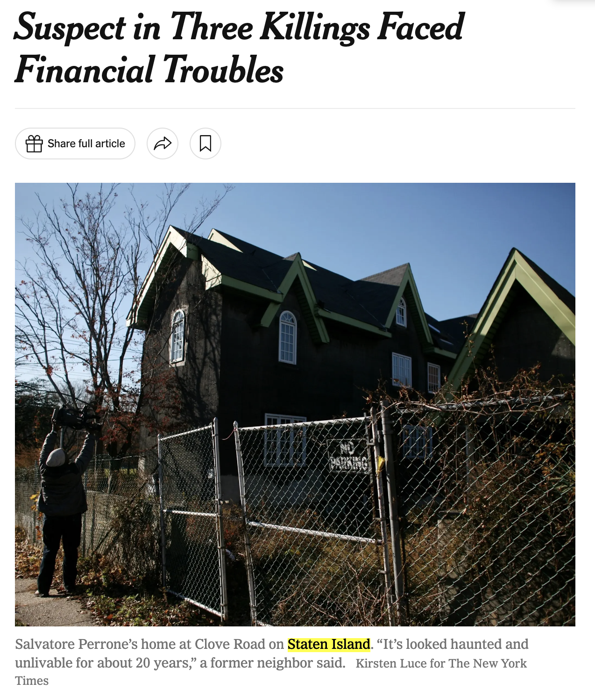

<h1 align="center">
  <br>
  <a href="https://github.com/euisungkang/NYC-Crime-Analysis"></a>
  <br>
  NYC Major Felony Offenses 
  <br>
</h1>

<p align="center">
  <a href="https://www.python.org/">
     
  </a>
  <a href="https://pypi.org/">
    
  </a>
  <a href="https://numpy.org/">
    
  </a><br>
  <a href="https://pypi.org/project/shapely/">
    
  </a>
  <a href="https://matplotlib.org/stable/">
    
  </a>
  <a href="">
    
  </a>
</p>

<p align="center">
  <a href="#overview">Overview</a>
  •
  <a href="#usage">Usage</a>
  •
  <a href="#visualizations">Visualizations</a>
  •
  <a href="#data source">Data Source</a>
  •
  <a href="#contributing">Contributing</a>
  •
  <a href="#license">License</a>
</p>

# Overview
The objective behind this project is to offer a valuable resource for both the general public and stakeholders interested in the historical patterns of major felony offenses in NYC. Although [NYC Open Data](https://opendata.cityofnewyork.us/) releases a majority of its data to the public, there haven't been any extensive visualizations and analysis on major felony offenses since 2018. Thus, with the latest available data, I aim to contribute to a better understanding of the city's safety landscape over the past two decades.

### Modules
 1. `NYCCrimePlots` : generates line plots by either precinct or borough
 2. `NYCCrimeHeatmap` : generates heatmaps by either precinct or borough
 3. `RelevantNews` : queries relevant news based on **location, topic, year**


# Usage
To run the program and generate the visualizations, follow these steps:

1. **Clone the repository:**
   ```bash
   git clone https://github.com/euisungkang/nyc-major-felonies.git
   ```
2. **Install the required dependencies**
    ```bash
    pip3 install -r requirements.txt
    ```
3. **Run the main script**
    ```bash
    python3 main.py
    ```

Make sure you have Python3 installed on your machine, and consider using a virtual environment to manage dependencies. Adjust the commands based on your project structure and requirements.

### Quickstart
```python
from NYCCrimePlots import Plots
from NYCCrimeHeatmap import Heatmap

plots = Plots()
heatmap = Heatmap()
```
Now we can get started generating visualizations.

# Visualizations

### Total Major Felonies by Precinct
```python
precinct = plots.totalFeloniesbyPrecinct()
```
<figure>
  
  <figcaption>Line plot showcasing the trend of total number of major felonies in each precinct from 2000 ~ 2022</figcaption>
</figure>

One of the first visualizations using the raw data provided is the Total Number of Major Felonies by Precinct over 22 years. At first glance, it's difficult to pinpoint any specific patterns. Perhaps, we can note that the general trend of major felony offenses has been on a downhill trend since 2000, with an uphill starting 2021. However, each of the 77 precincts in NYC has its own trend, and it's near impossible to distinguish between each one in the visualization. <br><br>
Let's try a better approach starting from a larger set of precincts: boroughs

### Average Major Felonies by Borough
```python
borough = plots.avgFeloniesbyBorough()
```
<figure>
  
  <figcaption>Line plot showcasing the trend of average number of major felonies in each borough from 2000 ~ 2022</figcaption>
</figure>

Immediately, we can notice the previous general patterns:
1. **Major felony offenses are on a general decline since 2000**
2. **Major felony offenses are on an incline from 2021**

However, we can also notice specific patterns such as Staten Island having a spike of offenses in 2012.<br>Let's take a closer look using the **line plot GUI.**

<p float="left">
  
  
</p>

Now we can use the `RelevantNews` module with the appropriate findings for better context behind what might've occurred at Staten Island in 2012.

```python
  from RelevantNews import News

  news = News()
  result = news.search("Staten Island", "Crimes", "2012")
```
Here are our top two results:
<p float="left">
  
  
</p>
With this sequence, we visualized major felony offenses across all precincts, and by borough. Furthermore, from a pattern we noticed, we could query relevant news surrounding the location, crime, and year.

### Heatmap by Precinct, by Borough
Additionally, heatmap visualizations are available using the `NYCCrimeHeatmap` module
```python
heatmap.precinctHeatmap(precinct)
heatmap.boroughHeatmap(borough)
```


<!-- 
#### Heatmap by Borough
<figure>
  
  <figcaption>Heatmap visualizations offering an at-a-glance view of major felonies distribution across boroughs</figcaption>
</figure>
### Average Major Felonies by Crime
<figure>
  
  <figcaption>Line plot showcasing the trend of average number of crimes by each felony type from 2000 ~ 2022</figcaption>
</figure> -->


# Data Source
The data is sourced from the [NYC Open Data](https://opendata.cityofnewyork.us/), and released by the [NYPD](https://www.nyc.gov/site/nypd/stats/crime-statistics/historical.page). The dataset spans from the year 2000 to 2022, providing a comprehensive view of major felony offenses in New York City.

# Contributing
If you'd like to contribute to this project, please check out our [contribution guidelines](CONTRIBUTING.md).

# License

Cover artwork created by [Midjourney AI](https://www.midjourney.com/explore).

Released under the [MIT](LICENSE) license.